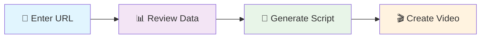

<div align="center">

# 🎬 AI Video Ad Generator

*Transform product URLs into compelling video advertisements with AI-powered automation*

[](https://reactjs.org/)
[](https://openai.com/)
[](https://nodejs.org/)
[](https://ffmpeg.org/)

[🚀 Quick Start](#-quick-start) • [✨ Features](#-features) • [🛠️ Tech Stack](#️-tech-stack) • [📖 Usage](#-usage) • [🐛 Troubleshooting](#-troubleshooting)

---

</div>

## 🌟 Features

<table>
<tr>
<td>

### 🔍 **Smart Product Scraping**
- Automatically extracts product data from Shopify and Amazon
- Intelligent image and feature detection
- Handles various e-commerce themes and layouts

</td>
<td>

### 🤖 **AI-Powered Script Generation**
- Uses OpenAI GPT-3.5 for compelling ad scripts
- Creates hook, body, and call-to-action sections
- Optimized for 15-30 second video ads

</td>
</tr>
<tr>
<td>

### 🎥 **Automated Video Creation**
- Professional video generation with FFmpeg
- Dynamic text overlays with proper styling
- 9:16 aspect ratio optimized for social media

</td>
<td>

### 🎨 **Modern User Interface**
- Beautiful, responsive React interface
- Step-by-step workflow with progress tracking
- Built with Tailwind CSS for modern design

</td>
</tr>
</table>

---

## 🏗️ Tech Stack

### Frontend
```
React.js 19        →  Modern UI framework
Tailwind CSS       →  Utility-first styling
Axios             →  HTTP client for API calls
React Player      →  Video preview component
```

### Backend
```
Node.js + Express →  Server framework
OpenAI API        →  AI script generation
Puppeteer         →  Web scraping automation
Cheerio           →  HTML parsing
FFmpeg            →  Video processing
Sharp             →  Image manipulation
```

---

## 📋 Prerequisites

Before running this application, ensure you have:

<table>
<tr>
<td align="center">

<br>
<strong>Node.js</strong>
<br>
v16 or higher
</td>
<td align="center">

<br>
<strong>FFmpeg</strong>
<br>
Video processing
</td>
<td align="center">

<br>
<strong>OpenAI API</strong>
<br>
Valid API key
</td>
</tr>
</table>

### 🔧 Installing FFmpeg

<details>
<summary><strong>📦 Ubuntu/Debian (WSL)</strong></summary>

```bash
sudo apt update
sudo apt install ffmpeg -y
```
</details>

<details>
<summary><strong>🍎 macOS</strong></summary>

```bash
brew install ffmpeg
```
</details>

<details>
<summary><strong>🪟 Windows</strong></summary>

Download from [https://ffmpeg.org/download.html](https://ffmpeg.org/download.html)
</details>

---

## 🚀 Quick Start

### 1️⃣ Install Dependencies

```bash
# 📦 Backend dependencies
cd backend
npm install

# 🎨 Frontend dependencies
cd ../frontend
npm install
```

### 2️⃣ Environment Setup

Your `.env` file should contain:
```env
# 🤖 OpenAI Configuration
OPENAI_API_KEY=sk-your-openai-api-key-here
MAX_TOKENS=2000

# 🌐 Server Configuration (optional)
PORT=5000
```

> ⚠️ **Important**: Make sure your OpenAI API key is valid and has sufficient credits.

### 3️⃣ Start the Application

```bash
# 🚀 Start Backend (Terminal 1)
cd backend
npm run dev

# 🎨 Start Frontend (Terminal 2)
cd frontend
npm start
```

### 4️⃣ Access the Application

- **Frontend**: [http://localhost:3000](http://localhost:3000) 
- **Backend API**: [http://localhost:5000](http://localhost:5000)

---

## 📖 How to Use

<div align="center">

### 🔄 **Simple 4-Step Process**

</div>



<table>
<tr>
<th>Step</th>
<th>Description</th>
<th>What Happens</th>
</tr>
<tr>
<td align="center">1️⃣</td>
<td><strong>Enter Product URL</strong></td>
<td>Paste a Shopify or Amazon product URL</td>
</tr>
<tr>
<td align="center">2️⃣</td>
<td><strong>Review Product Data</strong></td>
<td>Verify scraped information and images</td>
</tr>
<tr>
<td align="center">3️⃣</td>
<td><strong>Generate Script</strong></td>
<td>AI creates compelling ad copy</td>
</tr>
<tr>
<td align="center">4️⃣</td>
<td><strong>Create & Download</strong></td>
<td>Generate video and download MP4</td>
</tr>
</table>

---

## 🎯 Supported Platforms

<div align="center">

<table>
<tr>
<td align="center">

<br>
<strong>Shopify Stores</strong>
<br>
<em>*.myshopify.com & custom domains</em>
</td>
<td align="center">

<br>
<strong>Amazon Products</strong>
<br>
<em>Product page URLs</em>
</td>
</tr>
</table>

</div>

---

## 📁 Project Structure

```
🎬 agent-mode/
├── 🚀 backend/                 # Express.js server
│   ├── 📄 index.js            # Main server file
│   ├── 📦 package.json        # Dependencies
│   ├── 🌐 public/             # Static files
│   │   └── 🎥 videos/         # Generated videos
│   └── 📁 temp/               # Temporary processing
├── 🎨 frontend/               # React application
│   ├── 📄 src/
│   │   ├── 🎯 App.js          # Main component
│   │   ├── 🎨 index.css       # Styles
│   │   └── 🚀 index.js        # Entry point
│   ├── 📦 package.json        # Dependencies
│   └── ⚙️ tailwind.config.js  # Tailwind config
├── 🔐 .env                    # Environment variables
└── 📚 README.md               # This file
```

---

## 🔧 API Endpoints

<table>
<tr>
<th>Method</th>
<th>Endpoint</th>
<th>Description</th>
<th>Purpose</th>
</tr>
<tr>
<td><code>POST</code></td>
<td><code>/api/scrape</code></td>
<td>Scrape product data</td>
<td>🔍 Extract product info from URL</td>
</tr>
<tr>
<td><code>POST</code></td>
<td><code>/api/generate-script</code></td>
<td>Generate AI ad script</td>
<td>🤖 Create compelling copy</td>
</tr>
<tr>
<td><code>POST</code></td>
<td><code>/api/generate-video</code></td>
<td>Create video from data</td>
<td>🎥 Generate final MP4</td>
</tr>
</table>

---

## ⚠️ Important Notes

<div align="center">

### 💡 **Key Considerations**

</div>

| ⚡ **Performance** | 🔒 **Privacy** | 💰 **Costs** |
|-------------------|----------------|---------------|
| Video generation takes 30-60s depending on system | All processing is local | Monitor OpenAI API usage |
| Requires good internet for scraping | No data stored permanently | Be mindful of rate limits |
| FFmpeg uses system resources | Temporary files auto-cleaned | Each video costs ~$0.01-0.05 |

---

## 🐛 Troubleshooting

<details>
<summary><strong>❌ "FFmpeg not found"</strong></summary>

```bash
# Install FFmpeg and restart terminal
sudo apt install ffmpeg -y  # Ubuntu/WSL
brew install ffmpeg         # macOS

# Verify installation
ffmpeg -version
```
</details>

<details>
<summary><strong>❌ "OpenAI API Error"</strong></summary>

- ✅ Check your API key in `.env` file
- ✅ Ensure sufficient OpenAI credits
- ✅ Verify API key permissions
- ✅ Check network connectivity
</details>

<details>
<summary><strong>❌ "Product scraping failed"</strong></summary>

- 🔄 Try different product URLs
- 🛡️ Some sites block automated scraping
- 🌐 Check your internet connection
- ⏱️ Amazon may have stricter anti-bot measures
</details>

<details>
<summary><strong>❌ "Video generation failed"</strong></summary>

- 📦 Verify FFmpeg installation
- 💾 Ensure sufficient disk space
- 🖼️ Check if product images are accessible
- 🔧 Review console logs for detailed errors
</details>

---

## 📝 Sample URLs for Testing

### 🛍️ **Shopify Examples**
```
https://shop.gymshark.com/products/vital-seamless-2-0-leggings
https://allbirds.com/products/mens-tree-runners
https://www.bombas.com/products/mens-ankle-sock
```

### 🛒 **Amazon Examples**
```
https://www.amazon.com/dp/B08N5WRWNW
https://www.amazon.com/gp/product/B07FZ8S74R
```

> ⚠️ **Note**: Amazon URLs may have limited success due to anti-bot measures

---

## 🔒 Security & Privacy

<div align="center">

### 🛡️ **Your Data is Safe**

</div>

| 🏠 **Local Processing** | 🗑️ **Auto Cleanup** | 🔐 **Minimal Data** |
|------------------------|---------------------|---------------------|
| All processing on your machine | Temp files automatically removed | Only OpenAI API key required |
| No cloud data storage | No permanent data retention | Product data not stored |

---

## 🚀 Future Enhancements

<div align="center">

### 🎯 **Roadmap**

</div>

- 🎨 **Multiple video templates** and aspect ratios
- 🎤 **Text-to-speech narration** integration  
- ✨ **Advanced text animations** and effects
- 📦 **Batch processing** for multiple products
- 🌐 **More e-commerce platforms** (WooCommerce, Etsy)
- 🎵 **Background music** options
- 📊 **Analytics dashboard** for video performance

---

## 🤝 Contributing

We welcome contributions! Here's how you can help:

1. 🍴 **Fork** the repository
2. 🌟 **Create** a feature branch
3. 💻 **Make** your changes
4. 🧪 **Test** thoroughly
5. 📤 **Submit** a pull request

### 🔧 Development Setup

```bash
# Clone your fork
git clone https://github.com/yourusername/ai-video-ad-generator.git

# Install dependencies
npm install

# Create feature branch
git checkout -b feature/amazing-feature

# Make changes and commit
git commit -m "Add amazing feature"

# Push and create PR
git push origin feature/amazing-feature
```

---

## 📄 License

This project is for **educational and demonstration purposes**. Please respect website terms of service when scraping product data.

---

## 🆘 Support

<div align="center">

### 💬 **Need Help?**

</div>

If you encounter issues:

1. 📖 Check the [troubleshooting section](#-troubleshooting)
2. ✅ Verify all [prerequisites](#-prerequisites) are installed  
3. 🔍 Review console logs for detailed errors
4. ⚙️ Ensure your `.env` file is properly configured
5. 🐛 Create an issue with detailed error information

---

<div align="center">

### 🎬 **Ready to Create Amazing Video Ads?**

**[⬆️ Back to Top](#-ai-video-ad-generator)**

---

<sub>Built with ❤️ for the future of automated marketing</sub>

</div> 